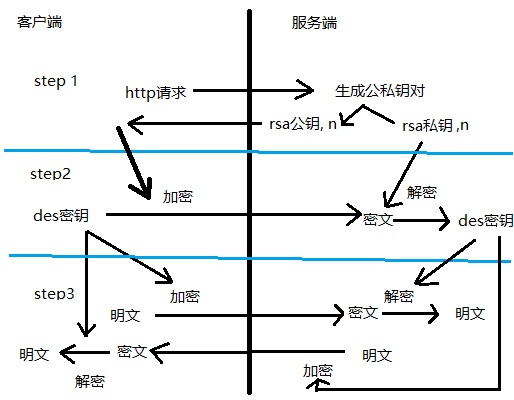

# rsa-des by garzon

### 实现
实验流程图如下，共分为3个步骤：

- step 1: 获取服务器端的RSA公钥
- step 2: 本地随机生成一个DES密钥，用服务器端的RSA公钥进行加密，发送回服务器，服务器解密后保存好DES密钥，用于step3中的通信
- step 3: 本地随机生成一个5位数字符串，来模拟通信内容，用DES加密后发送给服务端，服务端接受并解密后，将这个数字加一后，用DES加密后发送给客户端，完成通信过程

最后，由客户端解密，验证数字，从而证明整个实验过程中无差错。

### 实验输出

### 运行环境
php >= 5.4
64位php
python(依赖requests库来发送HTTP请求)
linux系统（在/tmp/目录下存放临时文件）

### 源代码
实验所用的客户端是rsa_lab.py，会发送HTTP请求来与服务器端的php脚本rsa_des_server.php来交互     
由于http协议的生命周期特性，实验当中服务器端需要临时存储的变量会放在/tmp目录下     
为了方便python与php之间的调用，传递的参数也会放在/tmp目录下供读取    
rsa的实现在rsa.py模块中     
前一个proj实现的des是des.php     
所以rsa_lab.py和rsa_des_server.php都会调用des.php和rsa.py     
python和php之间的相互调用通过命令行即python的os.system和php的system函数进行调用     
具体如下：    
客户端rsa_lab.py会调用des_encrypt.php和des_decrypt.php（两个对des.php封装的接口），来进行step3中的利用des与服务端进行安全通信     
服务端rsa_des_server.php会调用rsa.py中的gen_key_pair()和decrypt()，分别来进行step1中的生成密钥与step2中的解密接收到的rsa加密的des密钥     

### 使用说明
在服务端部署好代码后，     
在本地命令行输入`$ python rsa_lab.py`即可

### 注意事项
DES采用CBC模式PKCS5 padding
RSA中的字符串编码方式采用地址低端对应大整数的least significant bit